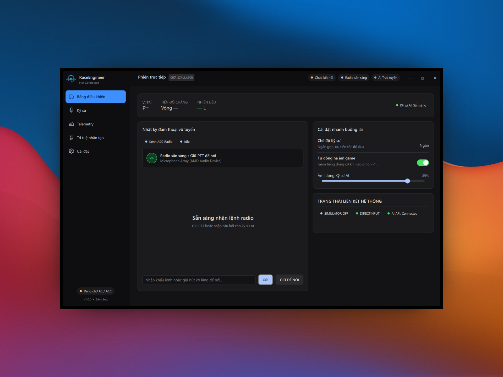

<div align="center">

[![Contributors][contributors-shield]][contributors-url] [![Forks][forks-shield]][forks-url] [![Stars][stars-shield]][stars-url] [![Issues][issues-shield]][issues-url] [![MIT License][license-shield]][license-url]

</div>

<a id="readme-top"></a>

<div align="center">
  <a href="https://github.com/tminh-U/RaceEngineer">
    
  </a>

  <h1 align="center">RaceEngineer</h1>

  <p align="center">
    A race engineer for sim racing
    <br>
    <a href="https://github.com/tminh-U/RaceEngineer/issues">Report a bug</a>
    ·
    <a href="https://github.com/tminh-U/RaceEngineer/issues">Request a feature</a>
  </p>
</div>

<!-- TODO: Replace the text, links, screenshots, and roadmap items below with your final project details. -->

<details>
  <summary>Table of Contents</summary>
  <ol>
    <li><a href="#project-information">Project Information</a></li>
    <li><a href="#getting-started">Getting Started</a></li>
    <li><a href="#documentation">Documentation</a></li>
    <li><a href="#contributing">Contributing</a></li>
    <li><a href="#contact">Contact</a></li>
  </ol>
</details>


## NOTE : The software only support running AI on CPU and AMD GPU (No Nvidia GPU support in the future)

## Project Information

RaceEngineer is a local race-engineering application that processes telemetry data from the game, calculates race logic, and handles voice input and output.

#### Features

- Read and analyze telemetry from Assetto Corsa and Assetto Corsa Competizone.
- Predict fuel usage, lap times, the distance between cars, and more.
- Communicate with the driver in real time in Vietnamese using `Phowhisper` and `VieNeu-TTS`.
- Important spotter messages remain available even without an LLM or network connection.
- Intuitive settings with features that can be enabled or disabled during use.
- Multiple voices to choose from, with files for training a custom voice for each user.
- Compatible with OpenAI-style LLMs.

<p align="center">
  
</p>

## Built with

- C++20
- CMake
- Qt 6 / Qt Quick
- MSVC Windows x64
- whisper.cpp and PhoWhisper-small Q5_1
- Native VieNeu-TTS v3 Turbo
- Vulkan acceleration

## Supported games

- Assetto Corsa
- Assetto Corsa Competizone

## Getting Started

### Requirements

- Windows x64
- Visual Studio 2022 with an x64 MSVC toolchain
- CMake 3.24 or newer
- Ninja
- Qt 6.5 or newer
- Assetto Corsa and/or Assetto Corsa Competizione
- Runtime models and voice assets
- Vulkan SDK (optional; recommended for GPU acceleration)

### Installation

1. Download `RaceEngineer-X.X.X-Setup.exe` from [Releases](https://github.com/tminh-U/RaceEngineer/releases).
2. Run `RaceEngineer-X.X.X-Setup.exe`.
3. Launch `RaceEngineer` and start using it.

### AC Python App

This is an optional addon for getting additional data from Assetto Corsa. The installer includes the addon at:

```text
<RaceEngineer install>\extras\AssettoCorsa\apps\python\RaceEngineer
```

Copy the `RaceEngineer` folder into Assetto Corsa's `apps\python` folder, or drag it into Content Manager.

### ACC Broadcasting

To use additional data such as opponent positions or the leaderboard, configure the ACC Broadcasting listener at:

```text
Documents\Assetto Corsa Competizione\Config\broadcasting.json
```

Then set it to a port that is not being used by another application, for example:

```json
{
  "udpListenerPort": 9000
}
```

## Documentation

- [Architecture](docs/architect.md) — application components and data flow.
- [Build Guide](docs/build.md) — development and release build instructions.
- [Voice Training Guide](docs/training.md) — training a custom VieNeu-TTS voice.
- [Vietnamese README](docs/readme_vie.md)

## Contributing

Contributions are welcome.

1. Fork the project.
2. Create a feature branch: `git checkout -b feature/my-feature`
3. Make and test your changes.
4. Commit your changes: `git commit -m "Add my feature"`
5. Push the branch and open a pull request.

Please keep simulator-specific telemetry inside its provider and preserve deterministic behavior for safety-critical spotter messages.

## Contact

Le Dinh Tue Minh — [@tminh-U](https://github.com/tminh-U)

## Acknowledgments

- [VieNeu-TTS](https://github.com/pnnbao97/VieNeu-TTS)
- [Phowhisper](https://github.com/VinAIResearch/PhoWhisper)
- [whisper.cpp](https://github.com/ggerganov/whisper.cpp)
- [Qt](https://www.qt.io/)
- Assetto Corsa and Assetto Corsa Competizione shared-memory telemetry

<!-- MARKDOWN LINKS & IMAGES -->

[license-shield]: https://img.shields.io/github/license/tminh-U/RaceEngineer.svg?style=for-the-badge
[license-url]: https://github.com/tminh-U/RaceEngineer/blob/main/LICENSE
[windows-shield]: https://img.shields.io/badge/platform-Windows%20x64-0078D4?style=for-the-badge&logo=windows
[windows-url]: https://github.com/tminh-U/RaceEngineer
[contributors-shield]: https://img.shields.io/github/contributors/tminh-U/RaceEngineer.svg?style=for-the-badge
[contributors-url]: https://github.com/tminh-U/RaceEngineer/graphs/contributors
[forks-shield]: https://img.shields.io/github/forks/tminh-U/RaceEngineer.svg?style=for-the-badge
[forks-url]: https://github.com/tminh-U/RaceEngineer/network/members
[stars-shield]: https://img.shields.io/github/stars/tminh-U/RaceEngineer.svg?style=for-the-badge
[stars-url]: https://github.com/tminh-U/RaceEngineer/stargazers
[issues-shield]: https://img.shields.io/github/issues/tminh-U/RaceEngineer.svg?style=for-the-badge
[issues-url]: https://github.com/tminh-U/RaceEngineer/issues
