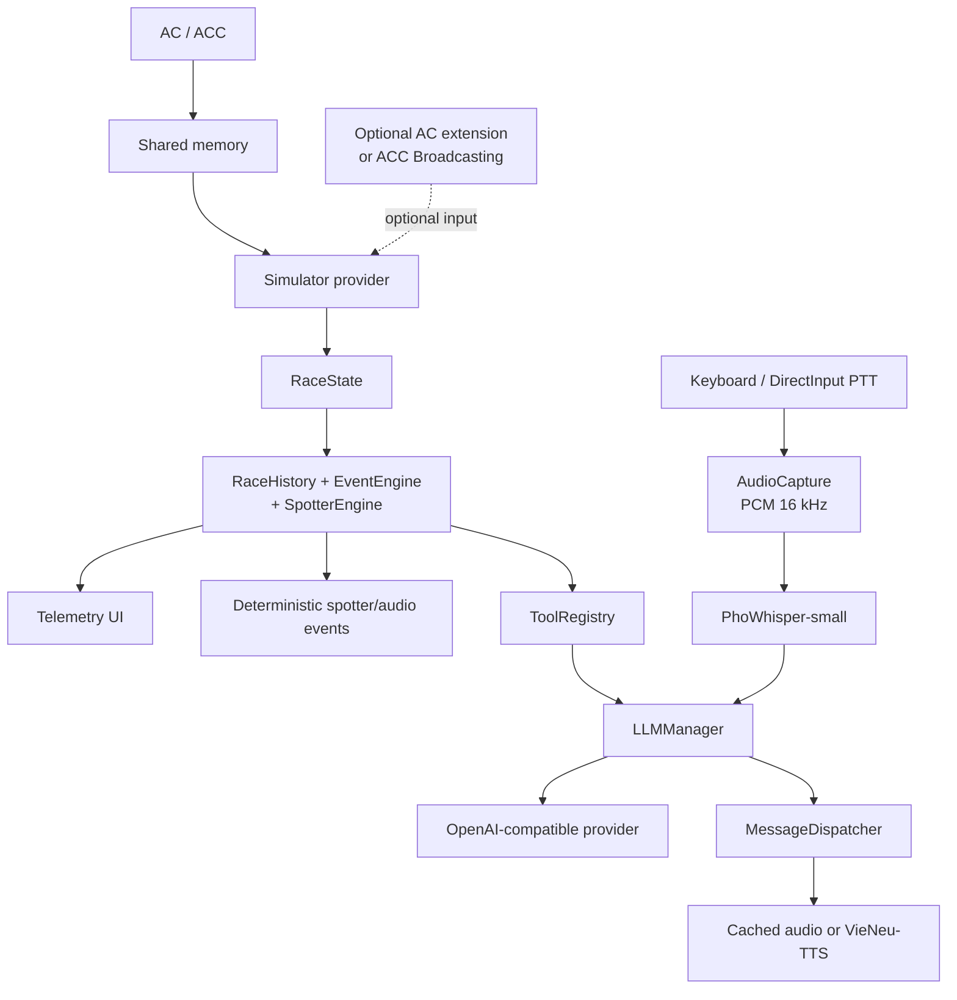
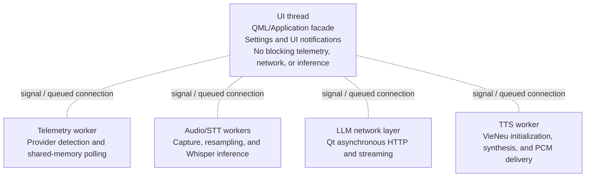

# RaceEngineer Architecture

## Purpose

RaceEngineer is a native Windows x64 application for sim racing. It reads
telemetry from Assetto Corsa (AC) and Assetto Corsa Competizione (ACC),
normalizes the data, runs deterministic race conclusions in C++, and provides a
user interface, voice input, spotter output, and LLM conversation.

The main flow is:

## Design principles

1. **Local-first:** telemetry, STT, TTS, and spotter behavior run locally.
   Network access and the LLM are an additional conversation layer.
2. **Deterministic code is authoritative:** C++ calculates fuel, lap, tyre,
   brake, engine, gap, event, and cooldown results. The LLM must not recalculate
   or change these conclusions.
3. **Simulator isolation:** shared-memory structures stay inside the AC/ACC
   providers. The remaining application layers receive only `RaceState`.
4. **No fabricated data:** a field that the simulator does not provide remains
   unavailable. Tools and responses must state this clearly.
5. **Bounded memory:** `RaceHistory` keeps only a bounded number of laps and
   trend samples. Conversation history is also trimmed to a bounded number of
   messages.
6. **Non-blocking UI:** telemetry, network requests, STT, and TTS run outside
   the UI thread or use asynchronous APIs.
7. **Graceful degradation:** a missing LLM, voice model, ACC Broadcasting
   connection, or AC extension must not break the core telemetry path.

## 1. Input layer

### AC and ACC shared memory

- `WindowsSharedMemory` opens the mappings provided by the simulator.
- `ACTelemetryProvider` reads the AC layout.
- `ACCTelemetryProvider` reads the ACC layout.
- Both providers normalize their output into `RaceState`.

The AC companion extension can provide additional data through the local shared
memory mapping `Local\race_engineer_ac_ext` and the internal UDP endpoint
`127.0.0.1:9996`. This data is used for 3D positions, opponents, and AC fields
that are not available in the standard shared memory.

If the extension is not running, AC still works with the available shared-memory
data. The additional fields remain unavailable.

### Optional ACC Broadcasting

`AccBroadcastClient` reads ACC Broadcasting data from the configured
`broadcasting.json` endpoint. It provides opponent identity, leaderboard data,
and other optional race information.

ACC Broadcasting must not be used to recalculate a gap that is already supplied
by the official ACC shared-memory graphics page. If Broadcasting is disabled,
shared-memory telemetry continues to work and the additional opponent fields
remain unavailable.

### Voice input

- Keyboard PTT or `DInputButtonMonitor` starts and stops recording.
- `AudioCapture` selects a Windows audio input, converts the signal to mono
  16 kHz PCM, and reports the microphone level.
- `VoiceInputController` manages one utterance and emits `utteranceReady` only
  when the user releases PTT.

### Text input

QML sends text questions directly through `Application::askText()`. Text and
voice requests enter the same `LLMManager`, so conversation history and
telemetry context are handled consistently.

## 2. Normalization layer

`RaceState` is the shared model for the entire application. It contains:

- simulator, session, and connection state;
- lap, position, track, speed, gear, and RPM;
- fuel, lap time, delta, and sector data;
- tyre temperature, pressure, and wear;
- brake, engine, oil, and water temperatures;
- flag, pit state, pit limiter, ABS, and traction control;
- gaps ahead and behind;
- opponent identity and opponent lists;
- world position and heading for the spotter;
- damage and suspension damage when supplied by the simulator.

Values without a reliable source use `std::optional` instead of fabricated
defaults.

## 3. Deterministic race analysis

### `RaceHistory`

`RaceHistory` keeps bounded history for:

- average fuel consumption;
- estimated laps remaining and fuel margin;
- average and best lap;
- session and provider trends.

### `EventEngine`

`EventEngine` converts continuous state into edge or transition events, such as:

- low or critical fuel;
- hot or critical engine;
- flag changes;
- pit limiter changes;
- session start;
- a new best lap;
- new damage;
- left, right, or three-wide car proximity when suitable data is available.

Events have cooldowns and priorities so repeated telemetry frames do not produce
repeated messages.

### `SpotterEngine`

`SpotterEngine` handles left, right, and three-wide proximity states. It uses
hysteresis: a car must remain in the relevant state long enough to engage, and
the condition must remain clear long enough to reset.

When reliable coordinates are unavailable, the spotter does not invent a
proximity warning.

## 4. LLM layer

### `ToolRegistry`

`ToolRegistry` publishes tool definitions and executes tools using `RaceState`
and `RaceHistory`. Tools return deterministic fields such as:

- `fuel_status`;
- `enough_fuel`;
- `spare_laps` and `missing_laps`;
- temperature status;
- gap trend;
- lap and fuel history.

Tools do not call the simulator directly and never send raw shared-memory
structures to the LLM.

### `LLMManager`

`LLMManager`:

1. receives text and a state snapshot;
2. adds bounded conversation context;
3. sends tool definitions when the provider supports them;
4. runs a bounded number of tool rounds;
5. preserves authoritative tool conclusions;
6. streams or receives the final response;
7. applies post-validation before returning the answer;
8. sends text to the UI and `MessageDispatcher`.

`ConversationManager` keeps a bounded number of turns.
`OpenAICompatibleProvider` handles HTTP, SSE streaming, `/models`, timeout,
cancellation, bounded retry, and error classification.

The LLM is never called automatically for every telemetry frame.

## 5. Output layer

### UI

`Application` is the orchestration boundary and the QObject facade for QML. It
exposes telemetry, connection state, event logs, conversation, audio, TTS, API
settings, and startup state through `Q_PROPERTY` and signals.

### Audio and speech

`MessageDispatcher` receives messages from events, the spotter, and conversation
requests, then orders them by `EventPriority`:

- critical and spotter messages are prioritized;
- lower-priority messages may be interrupted;
- requests carry a sequence ID so stale responses can be discarded;
- TTS failure does not discard telemetry.

Static spotter messages can use cached WAV audio. Dynamic responses use
`VieNeuTtsBackend`, `RacingTextNormalizer`, in-memory PCM, and `QAudioSink`.
`AudioDucker` lowers the game volume while speech is playing and restores it
afterward.

`SettingsManager` reads and writes application JSON settings:

- LLM provider, base URL, model, timeout, token limit, and streaming are stored
  in `LlmSettings`;
- keyboard and DirectInput PTT are stored in `PushToTalkSettings`;
- TTS voice, volume, output device, and ducking are stored in `TtsSettings`;
- API keys use `CredentialStore` and Windows Credential Manager instead of Git
  or the settings JSON file.

## 7. Threading boundary

Signal and queued connections are the main boundary between workers and the UI.
State is copied into a snapshot before it is sent to the LLM so the LLM layer
does not read data while it is changing.

## 8. Failure behavior

| Failure | Behavior |
| --- | --- |
| AC/ACC is not running | The UI shows disconnected; no fabricated telemetry is sent. |
| AC extension is not running | Additional 3D and opponent fields remain unavailable. |
| ACC Broadcasting is disabled | Shared-memory telemetry continues to work. |
| LLM timeout or API error | Local events and spotter behavior continue; conversation reports a short error. |
| Whisper or STT model is missing | Text input and telemetry UI can still work. |
| VieNeu or a voice model is missing | Text and telemetry continue; TTS reports unavailable. |
| TTS is busy | The dispatcher keeps priority and discards stale responses by sequence. |

## 9. Test boundary

`tests/RaceStateTests.cpp` runs offline without a simulator, microphone, network,
or API key. Tests cover normalization, mock telemetry, history and fuel,
event cooldowns, spotter hysteresis, conversation and tool JSON, and provider
parsing.
