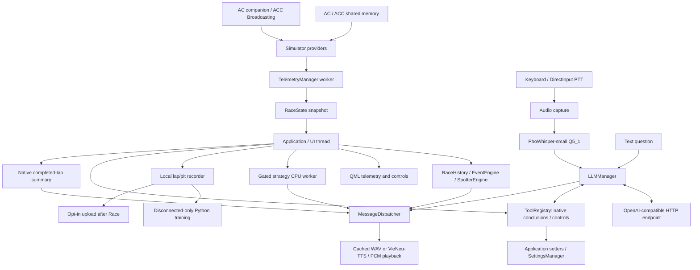

# RaceEngineer Architecture

This is the entry point for the current implementation, reviewed against the
source on 2026-09-30. RaceEngineer is a Windows x64, C++20/Qt 6 companion for
Assetto Corsa (AC) and Assetto Corsa Competizione (ACC).
[REQUIREMENTS.md](../REQUIREMENTS.md) holds project constraints and outstanding
validation. These chapters describe the code that exists now.

## Chapters

| Chapter | Contents |
| --- | --- |
| [Runtime, UI, settings and release](architecture/runtime-ui-storage.md) | Ownership, startup/shutdown, threads, QML, settings, credentials, storage, packaging and checks. |
| [Telemetry, radar geometry and spotter](architecture/telemetry-radar-spotter.md) | AC/ACC sources, companion protocols, normalization, history, gaps, proximity and deterministic events. |
| [Voice: STT, TTS and radio](architecture/voice-stt-tts.md) | PTT, capture, PhoWhisper, native VieNeu, compute devices, cached speech, priorities and ducking. |
| [LLM prompts, tools and feature controls](architecture/llm-prompts-tools.md) | Instructions, conversation, HTTP provider, authoritative tool results, settings writes and native lap summaries. |
| [Strategy, XGBoost and training data](architecture/strategy-xgboost.md) | Runtime planner/Ranker gates, research pace/tyre models, recording, local training, consent and sharing. |

## End-to-end flow

```mermaid
flowchart TD
    SIM["AC / ACC shared memory"] --> PROVIDER["Simulator providers"]
    EXTRA["AC companion / ACC Broadcasting"] --> PROVIDER
    PROVIDER --> TM["TelemetryManager worker"]
    TM --> STATE["RaceState snapshot"]
    STATE --> APP["Application / UI thread"]
    APP --> NATIVE["RaceHistory / EventEngine / SpotterEngine"]
    APP --> UI["QML telemetry and controls"]
    APP --> STRATEGY["Gated strategy CPU worker"]
    APP --> RECORD["Local lap/pit recorder"]
    RECORD --> TRAIN["Disconnected-only Python training"]
    RECORD --> SHARE["Opt-in upload after Race"]
    PTT["Keyboard / DirectInput PTT"] --> CAPTURE["Audio capture"]
    CAPTURE --> STT["PhoWhisper-small Q5_1"]
    STT --> LLM["LLMManager"]
    TEXT["Text question"] --> LLM
    LLM <--> API["OpenAI-compatible HTTP endpoint"]
    LLM <--> TOOLS["ToolRegistry: native conclusions / controls"]
    APP --> TOOLS
    TOOLS --> SETTERS["Application setters / SettingsManager"]
    NATIVE --> RADIO["MessageDispatcher"]
    STRATEGY --> RADIO
    APP --> SUMMARY["Native completed-lap summary"]
    SUMMARY --> RADIO
    LLM --> RADIO
    RADIO --> SPEECH["Cached WAV or VieNeu-TTS / PCM playback"]
```

## Responsibility boundaries

- **Simulator layouts stay in providers.** Other layers use `RaceState`,
  optional fields and normalized units, without inferring missing measurements.
- **C++ owns race conclusions and safety messages.** Fuel estimates, lap
  comparisons, event thresholds, gaps and proximity work without an LLM.
  The LLM receives deterministic tool results and must preserve them.
- **Conversation is request-driven.** Text or completed PTT utterances start
  LLM requests. Telemetry frames and automatic lap summaries do not.
- **Research is separate from approved strategy.** Local XGBoost pace/tyre
  training saves research artifacts. Runtime pit advice requires independently
  approved calibration or a validated Ranker bundle for the exact race profile.
- **UI and LLM share native feature setters.** Validation, persistence,
  cancellation and revisions belong to Application/ToolRegistry.
- **Blocking work uses workers.** Small bounded native analysis runs in
  `Application::onStateUpdated()` on the UI thread. Polling, capture, STT,
  TTS, strategy inference and disk work have workers; HTTP is asynchronous.

## Implementation status and limits

| Area | Current behavior / remaining validation |
| --- | --- |
| AC/ACC telemetry | Shared memory is the core source. Optional integrations add fields; absence stays explicit. |
| Proximity spotter | AC requires fresh companion wheel-contact geometry. Independent left/right warnings; no three-wide or clear callouts. Live directional/overlap calibration is pending. |
| ACC proximity | Opponent wheel geometry is unavailable; proximity is reported unsupported. |
| Radar | Wheel geometry supports spotter decisions. There is no dashboard radar renderer; external in-game radar is a validation reference. |
| STT/TTS | Local PhoWhisper and native VieNeu, with CPU or supported AMD Vulkan selection/fallback. Main UI startup currently requires both warm-ups. |
| LLM | OpenAI-compatible endpoint, bounded tool rounds/history, native conclusions and allowlisted feature writes. Local events do not depend on it. |
| Lap summary | Opt-in, assembled in C++ from completed laps, latest-only pending speech; no automatic LLM call. |
| Strategy | Planner and CPU XGBoost Ranker code exist; no approved deployable bundle is included. Missing/unapproved data prevents automatic pit advice. |
| Local training | CPU pace/tyre regressors use confirmed recordings and session holdout. ACC wear semantics need real-stint validation. |
| Sharing | Requires explicit consent, configured receiver and confirmed Race sessions. Raw local logs remain local; queued copies contain restricted fields. |

## Developer entry points

- [Application](../src/app/Application.cpp): construction, signals, state
  processing, feature setters, summaries and strategy integration.
- [RaceState](../src/telemetry/common/RaceState.h): normalized telemetry contract.
- [QML interface](../qml/Main.qml): views and the `backend` facade.
- [CMake](../CMakeLists.txt): sources, native assets, tests and install rules.
- [Build guide](build.md), [voice training guide](training.md) and
  [logging guide](logging-guide.md): operational instructions.

See the [runtime chapter](architecture/runtime-ui-storage.md#verification) for
offline checks and their limits.
