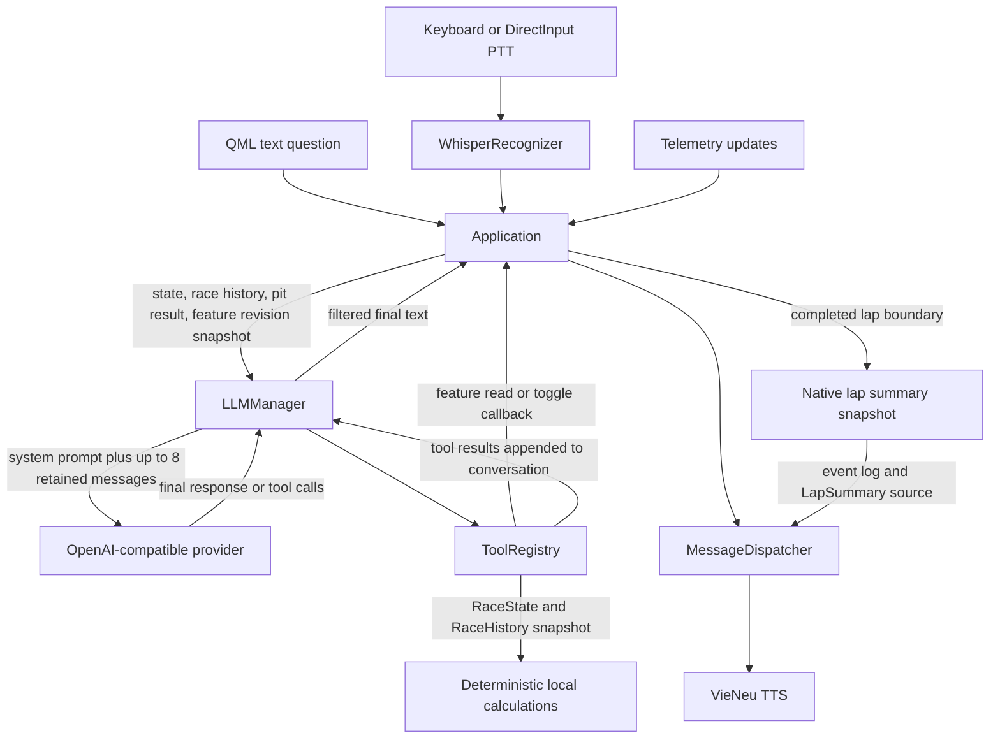

# LLM, prompts, tools, and lap summaries

[Architecture overview](../architect.md)

This page describes the implemented LLM and automatic lap-summary paths. The application uses the LLM for requested conversation, not for continuous telemetry analysis or automatic completed-lap summaries.

## Request and output flow



Text input and completed voice transcription reach the same `LLMManager::ask()` path. Each ask copies the latest [`RaceState`](../../src/telemetry/common/RaceState.h), [`RaceHistory`](../../src/race/RaceHistory.h), pit-strategy result, and feature-settings revision. Tools use those request snapshots. Feature settings are read through a live callback. Telemetry is not sent on every update; tools run only in response to a request.

## System prompt and other prompt text

The LLM system instruction is a C++ string assembled by [`LLMManager::systemPrompt()`](../../src/llm/LLMManager.cpp). There is no separate LLM prompt asset. The prompt contains these instructions:

- Use short, clipped, professional race-engineer radio language, normally one sentence and 10 to 25 tokens. The selected response style changes the target to 3 to 8 tokens for Minimal or 20 to 40 for Detailed.
- Use the caller's response language. Text questions request Vietnamese by default and English when clearly written in English. The voice path selects English only when the recognizer reports `en`; otherwise it requests Vietnamese. The current Whisper setup forces Vietnamese recognition.
- Do not invent telemetry. Call the relevant tool for live telemetry and car-condition questions. Treat returned status fields as authoritative, do not recompute or reinterpret them, and say when requested data is unavailable. If a tool returns `available: false`, answer that the data is unavailable without trying another tool.
- For supported settings, use `get_feature_settings` to answer status questions. Call `set_feature_enabled` only for a clear, explicit request, change only the named feature, and report its native result faithfully.
- Use dedicated guidance for pit-lap recommendations, position, lap pace, tyres, brakes, damage, wheel order, and formatted lap times. The prompt says to use supplied `_mmss` values and not convert them from raw seconds.
- Recover obvious speech-recognition errors from racing context, without inventing a request or silently changing ambiguous intent.

At request time the prompt appends limited live context when connected: position, current lap and total laps when supplied, session type, and track. It also appends the configured driver name and response-style instruction. Detailed live readings remain in tools, not in an automatic telemetry dump in the system prompt. Driver name and response style come from [`SettingsManager`](../../src/config/SettingsManager.h); the style setter normalizes the value to Minimal, Standard, or Detailed.

Whisper has a separate in-code `initial_prompt` with Vietnamese racing vocabulary and English terms such as `gap ahead`, `box lap`, `tyre`, `brake bias`, and `understeer`. That STT hint is in [`WhisperRecognizer.cpp`](../../src/stt/WhisperRecognizer.cpp); it is not the LLM system prompt.

## Conversation memory, output limits, and tool rounds

[`ConversationManager`](../../src/llm/ConversationManager.cpp) retains at most eight message objects in `LLMManager`'s current configuration. A message can be a user or assistant turn, an assistant tool-call message, or a tool result. The system prompt is prepended for each request and is not stored in the retained history. Trimming removes old messages and removes leading tool results when needed so a tool result is not left without its assistant tool call. `resetConversation()` cancels the active provider request and clears this history.

Each request includes the current request snapshot and prior retained conversation. Output length is controlled by the `maximum_tokens` setting, default 64 and clamped to 16 through 512. The code records provider-reported prompt and completion token usage, but does not estimate or enforce an input-token budget. The message-count cap is the context bound.

When a provider supports tool calling, `LLMManager` sends the definitions with `tool_choice: auto`. Tool-call arguments must parse as a JSON object. Missing call IDs are assigned local IDs. Calls in a response are executed in order and their results are appended to the conversation. The manager executes at most two tool-call rounds; after the second it sends a request without tools. A defensive third tool-call response produces a short unavailable-data fallback. A new request cancels the previous provider request, refreshes the snapshots, resets the round counter, and keeps the conversation history.

The response path removes common reasoning wrappers before display or speech. If `get_fuel_status` returned an authoritative `enough_fuel` result, a final text check replaces obvious English or Vietnamese fuel-surplus/deficit contradictions with a message based on the supplied spare or missing laps. This post-check is specific to fuel wording; other telemetry conclusions are governed by tool outputs and prompt instructions.

## Tool catalog

The definitions and execution live in [`ToolRegistry`](../../src/llm/tools/ToolRegistry.cpp). All tools are local function calls over request snapshots or the feature callbacks. Read tools use no arguments except `get_driver_pace`; the feature setter takes the two listed arguments.

| Tool | Arguments | Deterministic result or responsibility |
| --- | --- | --- |
| `get_feature_settings` | None | Current supported feature values, enable availability, and revision. |
| `set_feature_enabled` | `feature` from the supported ID list; `enabled` boolean | Requests one native feature change through `Application`. |
| `get_session_status` | None | Connected simulator, track, session, lap and remaining time/laps when available. |
| `get_position` | None | Player position and leader/ahead/behind identity when available. |
| `get_leaderboard` | None | Live opponent leaderboard and player/leader entries when opponent data is available. |
| `get_driver_pace` | `driver` string | Named driver's position and lap pace from available opponent data. |
| `get_gap_ahead` | None | Pre-calculated gap-ahead value and trend. |
| `get_gap_behind` | None | Pre-calculated gap-behind value and trend. |
| `get_fuel_status` | None | Fuel amount, history-based consumption and remaining-lap estimate, and authoritative surplus/deficit fields when calculable. |
| `get_tyre_status` | None | Available wheel temperatures, pressures, wear, and deterministic temperature classifications. |
| `get_brake_status` | None | Available wheel brake temperatures and deterministic critical status. |
| `get_engine_status` | None | Available RPM and engine/oil/water temperatures with deterministic overheating status. |
| `get_damage_status` | None | Body-damage channels and ACC suspension-damage wheels when the simulator supplies them. |
| `get_current_lap` | None | Current lap, time, and delta when supplied. |
| `get_lap_times` | None | Current/previous/best/average lap times and native trend/consistency classifications. |
| `get_recent_laps` | None | Up to five retained laps with time and available fuel used, plus trend/consistency. |
| `get_best_lap` | None | Best lap retained in `RaceHistory`. |
| `get_sector_analysis` | None | Best sectors and current largest loss sector when current and best-sector data permit it. |
| `get_pit_status` | None | Pit state and pit limiter when supplied. |
| `get_pit_strategy` | None | The application's current approved strategy result. An empty result is unavailable; the LLM does not choose a pit lap. |
| `get_flag_status` | None | Current flag when supplied. |
| `get_race_summary` | None | Compact connected-session, position, fuel, lap, and gap fields. |

Unavailable source fields are omitted or the tool returns `{ "available": false }`; unknown tool names also return unavailable. Tools do not reach back into simulator memory. Fuel, gaps, damage classifications, brake/engine status, and lap/sector analysis are supplied by native code. The LLM must not derive a replacement conclusion from raw values.

The advertised function schemas disallow additional properties. At execution, the manager requires a non-empty function name; absent arguments become `{}`, while supplied arguments must be a JSON object or an object encoded as JSON text. `set_feature_enabled` independently requires exactly two fields with a string `feature` and boolean `enabled`; `get_driver_pace` requires a non-empty driver string. The other tools have no declared arguments. An unavailable tool result is not converted into a guess.

## Feature controls and stale-setting protection

`ToolRegistry` declares these feature IDs for the setting tools: `spotter`, `fuel_alerts`, `tyre_alerts`, `lap_delta`, `flag_alerts`, `damage_alerts`, `lap_summary`, `audio_ducking`, `pit_strategy`, `ptt_keyboard`, `ptt_directinput`, and `race_recording`.

[`Application::featureSettings()` and `Application::setFeatureEnabled()`](../../src/app/Application.cpp) expose the same native settings used by QML. The read result contains each feature's enabled state, whether it can be enabled, an optional reason, and a revision. A write must identify an advertised feature. A state-changing write rejects a stale revision; an already-applied target state returns idempotent success without rewriting settings, subject to the native availability check. Enabling an unavailable feature is rejected; successful writes call the same application setter as the UI. For example, DirectInput PTT cannot be enabled before a device/button is assigned, and pit strategy availability follows the runtime strategy check. Settings such as lap summaries, audio ducking, push-to-talk, and recording remain controlled by their own native setters.

The request carries the revision captured when the driver asked. After a successful tool write, the manager adopts the returned revision for later writes in that same request. UI changes during model generation therefore make the old revision fail instead of overwriting a newer setting. Several feature setters also cancel pending audio for the disabled source; lap-summary cancellation is described below.

## Provider, model discovery, settings, and errors

[`LLMManager`](../../src/llm/LLMManager.cpp) currently constructs [`OpenAICompatibleProvider`](../../src/llm/providers/OpenAICompatibleProvider.cpp), whose tool-calling capability is enabled. It appends `/chat/completions` and `/models` to the configured base URL as needed. `testConnection()` issues `GET /models` and checks the selected model against the returned `data[].id` values, accepting an optional `models/` prefix. The QML settings screen has a model text field; this endpoint check verifies that selected ID, it does not populate a model picker.

`SettingsManager` stores provider label, base URL, model, streaming, timeout, maximum output tokens, temperature, and reasoning flag in `<AppConfigLocation>/settings.json`. The LLM API key is stored separately through Windows Credential Manager as `RaceEngineer/LLMApiKey`; it is not written to settings JSON. The provider sends a non-empty key as a Bearer authorization header. Settings clamp timeout to 1 to 60 seconds, maximum tokens to 16 to 512, and temperature to 0 to 1. The reasoning flag adds provider/model-specific request fields only for recognized Gemini, Gemma, local thinking, and reasoning models. See [`SettingsManager`](../../src/config/SettingsManager.cpp), [`CredentialStore`](../../src/config/CredentialStore.cpp), and [`Application::saveAiSettings()`](../../src/app/Application.cpp).

Streaming responses are read as SSE and accumulate content, tool-call fragments, and usage. Requests can be cancelled and use the configured timeout. A chat request retries once, after 250 ms, for timeout/temporary network failures or HTTP 5xx only when no streamed content or tool calls have arrived. The connection test also retries once after 250 ms for a network error or non-200 response. Status handling distinguishes 401/403 authentication errors, 429 rate limiting, network failures, and provider errors; response bodies are parsed for a provider message when possible. A chat API failure increments failure/rate-limit statistics. A pending native feature-change confirmation is returned even if the follow-up model request fails.

## Native completed-lap summaries

Automatic lap summaries are generated in [`Application::updateLapSummary()`](../../src/app/Application.cpp), not by the system prompt, a tool call, or the LLM. The feature is opt-in and defaults off. The app detects completed-lap boundaries from the current lap counter and uses the matching completed lap already recorded in `RaceHistory`.

For AC or ACC Race, Practice, Qualifying, Hotlap, or Time Attack sessions, an enabled summary can include the completed lap number/time, pace versus the adjacent prior clean lap, fuel used across clean finite fuel-boundary samples, current position, and gap ahead when supplied. A non-consecutive, incomplete, pit, yellow, red, or black-flag context prevents the pace/fuel comparison and the summary says the comparison is unavailable. It does not fabricate missing values.

The native text is logged and stored as the latest summary, then queued at conversation priority with source `LapSummary`. There is one pending/latest summary rather than a backlog of old laps. While PTT recognition or an LLM reply is busy, `speakPendingLapSummary()` leaves the latest summary pending. The dispatcher allows urgent radio to preempt speech and retains an interrupted summary unless a newer summary is waiting. Disabling the feature or changing simulator session cancels its pending and queued audio. Session changes include simulator, track, car, total laps, session type, disconnect, or a lap-counter rollback; they reset summary baselines and clear the displayed latest summary. Enabling the option does not replay older laps.

The race session key also resets `RaceHistory`, so live tools use data from the active session. The conversational message history is separate and is cleared by the explicit conversation reset; it is not automatically cleared on a race-session change. The prompt still requires tools for live telemetry questions.

## Offline checks

`RaceStateTests` covers conversation message shape, tool availability and feature arguments, provider model-list/response parsing, and system-prompt instructions. `docs/build.md` documents the existing CMake test workflow:

```powershell
cmake -S . -B build-debug -G Ninja `
  -DCMAKE_BUILD_TYPE=Debug `
  -DCMAKE_PREFIX_PATH=C:\Qt\6.8.3\msvc2022_64
cmake --build build-debug --parallel
ctest --test-dir build-debug --output-on-failure
```

The tests are offline and do not require an API key, simulator, or network service. Test targets are defined in [`CMakeLists.txt`](../../CMakeLists.txt); relevant assertions are in [`RaceStateTests.cpp`](../../tests/RaceStateTests.cpp).
