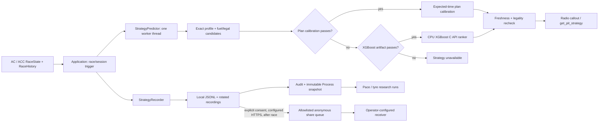

# Strategy, XGBoost, and Local Training

[Back to the architecture overview](../architect.md)

## Runtime boundary

The native strategy path is opt-in and separate from the local training tools. `Application` supplies normalized `RaceState` and `RaceHistory` to `StrategyPredictor`; the predictor enumerates legal pit-lap candidates and uses one qualified artifact, if one is installed. A qualified `plan_calibration.json` takes precedence. Otherwise it can load the separately gated XGBoost ranker. Local pace and tyre regressors are research outputs and are not loaded by this runtime path.

The [native predictor](../../src/strategy/StrategyPredictor.cpp) is the runtime decision boundary. The [application integration](../../src/app/Application.cpp) refreshes strategy by lap, rejects results from a changed session or lap, rechecks legality before accepting a result, and sends only an available selected lap to the strategy tool and radio. `pit_lap` means pit at the end of that lap. The LLM reads this result through [`get_pit_strategy`](../../src/llm/tools/ToolRegistry.cpp); it must not infer a pit lap when the strategy is unavailable.

The persisted strategy switch and artifact availability are separate. Turning the switch on does not qualify an artifact. In the repository state documented here, there is no approved bundle under `models/pit_strategy/`, so the app reports the missing artifact and does not issue a synthetic recommendation.

## Runtime XGBoost ranker

### Candidate and feature contract

The model scores each candidate lap for one exact race profile. The application first requires a connected AC or ACC Race session, a known track and car model, matching total laps, usable current lap and laps remaining, plus fuel and lap-history estimates. The profile supplies the pit window, reserve and pit-loss estimate. Candidate laps are limited to that window and the fuel reserve constraint; gaps may be missing and are represented as NaN. The app then selects the highest score, with ascending candidate order retaining the earlier lap on a score tie.

The schema is version 1 and its feature order must match this list exactly:

| Feature | Meaning |
| --- | --- |
| `laps_remaining` | Race laps remaining at decision time |
| `fuel_laps_remaining` | Deterministic fuel estimate from `RaceHistory` |
| `reserve_laps` | Profile fuel reserve |
| `stint_laps` | Completed laps in the current stint |
| `pace_mean_s` | Recent mean lap time |
| `pace_trend_s` | Recent lap-time trend |
| `gap_ahead_s`, `gap_behind_s` | Optional gaps; missing values remain NaN |
| `pit_loss_s` | Profile pit-loss estimate |
| `window_open_offset`, `window_close_offset` | Profile window relative to the current lap |
| `candidate_offset` | Candidate lap relative to the current lap |

The notebook contract is a labeled candidate table: one row per candidate in a `decision_id`, grouped by `session_id`, with profile/domain, current and candidate laps, label provenance, `relevance` (integer 0–3, higher is better within a decision), `outcome_cost_s`, and the 12 features. All features except the two gaps are required. `outcome_cost_s` represents remaining-time cost under the label source's stated assumptions; raw lap timing alone does not establish an optimal pit-lap label. Training and test splits keep complete sessions together. See [`train_pit_ranker.ipynb`](../../training/pit_strategy/train_pit_ranker.ipynb) for the CSV template, validation, and evaluation.

### Artifact and approval checks

The app loads the XGBoost C API from `xgboost.dll`, loads `pit_ranker.json` once, sets `nthread=1` and CPU device, and reuses it for lap-triggered inference. Python and XGBoost packages are not needed for inference. Before exposing the model, the [runtime loader](../../src/strategy/StrategyPredictor.cpp) checks:

- `manifest.json` declares `deployment_ready: true`, `mode: "real"`, and no `toy_simulation` label method.
- The manifest metrics contain at least 10 held-out races; mean simulation regret is at most 90% of the best baseline regret; the 95% improvement lower bound is positive; p90 regret is no worse than the best baseline p90; and legal-choice rate is exactly 1.0.
- SHA-256 values for the model JSON and `xgboost.dll` match the manifest.
- `feature_schema.json` is version 1, has the same profile ID as the manifest, and lists the exact 12 features in runtime order.
- The profile identifies one exact simulator, track, car model, and lap-count race, has a matching profile ID, and confirms a mandatory stop, validated service, and dry conditions. At runtime, telemetry must match that profile.
- `parity_vectors.json` has rows in the same feature shape and candidate count as its expected scores. The native C API must reproduce the training scores within `1e-6 + 1e-6 * abs(expected)` before the runtime is made available.

The release packaging rules in [`CMakeLists.txt`](../../CMakeLists.txt) copy a ranker only when its manifest is marked deployable, and require the model, schema, parity vectors, manifest, profile, XGBoost DLL, and license file. These gates inspect the declared evaluation metrics and parity fixture; they do not rerun held-out races in the app.

## Separately gated plan calibration

`plan_calibration.json` is an independent path, not an XGBoost model. If its runtime gate passes, it takes precedence over the ranker. It enumerates legal laps with fuel legality checked before and after the stop, then compares expected remaining time using calibrated fresh-lap pace, stint-age penalty, fuel penalty, and pit loss. If the best choice is not decisive beyond its uncertainty/decision margin, the app reports a pit window and withholds an automatic callout.

The [plan gate](../../src/strategy/StrategyPredictor.cpp) requires schema version 1, `deployment_ready: true`, a 64-character lowercase hexadecimal source hash, exact profile identity, at least 10 calibration sessions, at least 10 held-out and 10 prospective races, pace MAE no worse than its baseline, positive improvement confidence lower bound, and legal-choice rate 1.0. The profile must describe a lap-count race with one validated mandatory stop, dry conditions, validated fresh start tyres and tyre change, and validated fixed pit loss. Refueling requires explicit profile data and validated refuel-amount control. Current fuel and capacity telemetry must also make the proposed stop legal.

[`calibrate_pit_plan.py`](../../training/pit_strategy/calibrate_pit_plan.py) currently emits research-only output (`deployment_ready: false` and empty approval metrics). The runtime checks the source-hash field's format and the declared gate metrics; it does not recompute source-file hashes or race evaluations at startup. A valid profile alone is not approval.

## Recording and local research training

`StrategyRecorder` writes asynchronously to the app's `AppLocalDataLocation/pit_strategy_laps.jsonl`. At 20 MiB the active file is moved to `recordings/` with a unique name; archives are retained until the user removes them. At most 32 pending writes are accepted; overflow drops a sample and reports a warning/status. The persisted recording control is exposed by `Application` and the analysis/strategy UI.

Lap records contain simulator, session ID, UTC capture time, completed lap and time, sample lap, track/car/category/subclass, total laps, and available fuel, gap, four-wheel wear and temperature samples. Pit lane entry/exit and pit box entry/exit are distinct `record_type` values. Those events show a visit, not that fuel or tyre service occurred; run [`audit_sim_logs.py`](../../training/pit_strategy/audit_sim_logs.py) before using a log for calibration or labels. Laps can be marked excluded for observed pit/caution state and the initial partial lap. Before a Race, the driver confirms that fuel and tyre settings are realistic; this is self-attestation because the app cannot read the game's multipliers. Unconfirmed sessions are retained locally but excluded from processing and sharing. Details are in the [logging guide](../logging-guide.md).

The UI's Process, Train XGBoost pace, and Train tyres actions run [`local_training.py`](../../training/pit_strategy/local_training.py) in a separate Python process only while disconnected. Reconnecting cancels a running job. Python is found on `PATH` or at `training/python/python.exe` beside the app; training requires `numpy` and `xgboost`. The app does not install packages or start training on the network. Outputs and reports live under local app data `training/`, not in the runtime strategy bundle.

Process reads active, archived and legacy `.old` JSONL, filters by realistic-setup confirmation and lap quality, handles pit-adjacent boundaries, then atomically publishes a `raceengineer_pace_pairs_v3` snapshot. Training consumes that snapshot and reports changed source signatures; rerun Process to incorporate newer logs. Signatures compare relative path, byte size and modification time, not content hashes. Legacy rows without `lap_excluded` cannot establish observed flag/pit quality, and session IDs alone do not establish session type. The current research outputs are:

- **Pace:** CPU XGBoost regressors grouped by simulator and vehicle category. The target is next clean lap time minus current lap time in seconds. Features are `current_lap_time_s`, `rolling_3_lap_s`, `current_lap`, and dynamic `subclass::<value>` indicators. The zero-change baseline predicts the next lap equals the current lap. These inputs are distinct from the runtime Ranker's 12-feature schema.
- **Tyres:** Separate CPU regressors per simulator/category and target, using one example per wheel at a lap boundary. Features are `current_lap_time_s`, `rolling_3_lap_s`, `current_lap`, `current_fuel_l`, `current_wear`, `current_core_temp_c`, and `wheel_index`. Targets are next-minus-current boundary wear in source-native units or core temperature in degrees C; unavailable optional inputs remain NaN. The baseline is unchanged wear/temperature. Wear semantics, particularly ACC's, are unverified; temperature is not independently calibrated for pit use.

Both paths require at least three independent sessions and 60 unique labeled lap pairs per group/target, then at least 40 training and 10 validation pairs. Tyre sample counts use unique session/lap pairs, not the four wheel rows as four independent laps. The most recent complete sessions form the holdout (initially 20%, expanded when needed); a session never spans train and validation. CPU fitting uses `n_jobs=1`. After measuring holdout MAE against the baseline, a final research model is fitted on all eligible rows and saved with feature names, hashes and evaluation reports; this does not pass runtime approval gates.

The UI launches `local_training.py --action process|train|train-tyres --data-dir <local-data> --output-dir <local-data>/training`. Process needs only the Python standard library; fitting needs installed numpy/xgboost. Run these through the disconnected-only UI to retain its reconnect/cancel guards; launching the script manually does not itself detect a running simulator.

Neither local model is consumed by `StrategyPredictor`, and neither can enable pit controls. The testable local pipeline is covered by [`test_local_training.py`](../../tests/test_local_training.py); the recorder has a native test in [`StrategyRecorderTests.cpp`](../../tests/StrategyRecorderTests.cpp).

## Data sharing

Optional race-data sharing is off until the user consents and a receiver is configured. The app accepts an operator-supplied HTTPS endpoint and token from `.env` beside the executable or process environment; endpoint and token are validated before sharing becomes available. Previously saved endpoint settings and the Windows Credential Manager token remain readable as fallbacks; `.env` overrides them, then process environment values take precedence. The session is prepared after the race only if every row has realistic-setup confirmation. The share copy contains an allowlist of lap, pit, vehicle and telemetry fields, replaces the session ID, rebases timestamps while preserving relative intervals, and is queued under app-local `share_queue/`. Upload waits while a race is active. Disabling consent aborts upload and deletes queued share copies; original local recordings remain.

Generic receivers get NDJSON with a bearer token. The Google Apps Script receiver gets the token followed by JSONL as POST text and the app dequeues the copy only after an accepted response. [`share_receiver.py`](../../production/share_receiver.py) and [`google-drive-receiver.gs`](../../production/google-drive-receiver.gs) are optional receiver implementations. The Oracle pilot requires a TLS reverse proxy and a server-side token; the Google Drive receiver uses the owner's Apps Script deployment. The repository configures no endpoint by default. See [`production/README.md`](../../production/README.md) for deployment setup.

## Current gaps and checks

- There is no approved AC/ACC pit-decision dataset, ranker bundle, or planner calibration in the repository. The ranker notebook defaults to synthetic demo rows and always exports `deployment_ready: false`. The F1 research pilot uses simplified simulated labels and failed its baseline gate (0.210 s mean regret versus 0.201 s for earliest legal pit on 16 held-out races); it is not an AC/ACC model.
- Local pace and tyre regressions are useful only for their stated research targets. They do not fill the missing pit-decision labels, validate ACC wear, or authorize recommendations.
- Ranker and plan gates depend on trustworthy artifact metadata and evaluation evidence. Production approval still needs independent held-out and prospective races, valid service/fuel/tyre calibration for an exact profile, and parity/package checks. No timed race, no-stop race, multi-stop plan, or broad vehicle/track coverage is supported by this v1 contract.

Relevant offline checks are `ctest --test-dir build --output-on-failure` for native targets and `python tests/test_local_training.py` for processing and small synthetic fitting cases when numpy/xgboost are installed. See [build instructions](../build.md). Full dataset training, downloads and live simulator validation are separate operations.
