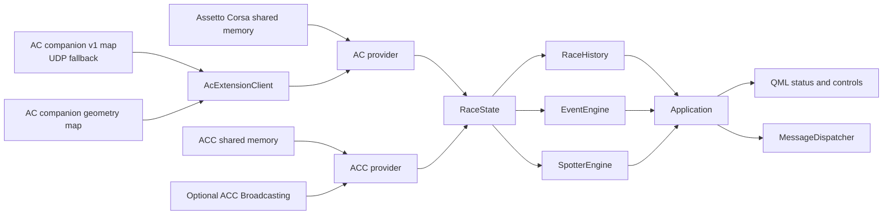

# Telemetry, Radar Geometry, and Deterministic Analysis

This note documents the current telemetry, proximity Spotter, and deterministic
analysis path. The broader [architecture overview](../architect.md) covers the
rest of the application.

## Sampling, provider selection, and session resets

[`TelemetryManager`](../../src/telemetry/TelemetryManager.cpp) detects the
simulator once per second, preferring ACC if both supported processes are
reported. It polls the active provider every 33 ms (about 30 Hz) and emits
state updates at up to the same rate. Provider selection stops the previous
provider first. A failed start publishes an empty disconnected state and is
retried on the next detection tick. When no simulator is selected, the manager
publishes a disconnected `RaceState`. A provider read that cannot obtain a
stable physics page is skipped; it does not fabricate a replacement sample.

[`Application`](../../src/app/Application.cpp) receives telemetry on the UI
thread through a queued connection. It derives a session key from simulator,
track, car, lap limit, and session type. A changed key, a lap counter rollback,
or disconnect resets
[`RaceHistory`](../../src/race/RaceHistory.cpp), `EventEngine`, and
`SpotterEngine`; it also cancels pending proximity speech. `RaceState` has no
global generation number. The AC companion maps have their own sequence
counters, used to distinguish a newly published snapshot from an old one.

## Simulator sources and capabilities

The simulator providers keep native shared-memory layouts out of the rest of
the application. They copy stable physics pages before normalizing values.
Physics is required to connect; graphics and static pages enrich the state when
available. [`RaceState`](../../src/telemetry/common/RaceState.h) uses
`std::optional` for unavailable readings instead of assigning synthetic zeroes.
Wheel arrays use `FL, FR, RL, RR` order.

Both games expose the local mappings `Local\acpmf_physics`,
`Local\acpmf_graphics`, and `Local\acpmf_static`; each provider decodes them
with its simulator-specific layout ([AC](../../structed_file_AC.h),
[ACC](../../structed_file_ACC.h)). ACC Broadcasting reads the configured UDP
port and passwords from
`Documents/Assetto Corsa Competizione/Config/broadcasting.json`.

The native readers are [`ACTelemetryProvider`](../../src/telemetry/ac/ACTelemetryProvider.cpp),
[`ACCTelemetryProvider`](../../src/telemetry/acc/ACCTelemetryProvider.cpp), and
the optional [`AccBroadcastClient`](../../src/telemetry/acc/AccBroadcastClient.cpp).

| Data | Assetto Corsa | Assetto Corsa Competizione |
| --- | --- | --- |
| Player telemetry | Required `acpmf_physics` supplies speed, RPM, gear, controls, fuel, tyre core temperatures/pressures/wear, body damage, heading, pit limiter, TC, and ABS. Optional graphics supplies coordinates and session/lap/position/flag/pit values; static supplies track/car/driver metadata and fuel capacity. | Required `acpmf_physics` supplies speed, RPM, gear, controls, fuel, tyre/brake readings, body and suspension damage, and water temperature. Optional graphics supplies coordinates, session/lap/position/timing/gaps/flags/pit values; static supplies track/car/driver metadata and fuel capacity. |
| Opponent records and identity | Optional Python companion publishes position, speed, lap times, world position, names, and team/car labels through `race_engineer_ac_ext`; UDP on `127.0.0.1:9996` is a legacy-field fallback. | Optional official ACC Broadcasting UDP client supplies driver/team identity, positions, lap data, sectors, spline progress, and pit-lane state. The graphics page supplies opponent world positions. |
| Gap ahead/behind | The companion selects the adjacent leaderboard car and computes an approximate time gap. Without fresh companion telemetry the fields are absent. | The provider converts official graphics-page `gapAhead` and `gapBehind` milliseconds to seconds. Broadcasting does not replace or recalculate these values. |
| Spotter geometry | Supported only with fresh wheel-contact data from `race_engineer_ac_spotter`. | Unsupported. ACC world positions and Broadcasting identities do not provide the wheel-contact footprints required by the current Spotter. |

ACC Broadcasting is optional. If the JSON config or listener port is
unavailable, the ACC shared-memory provider continues to supply supported
telemetry, including official graphics-page gaps.

The optional AC companion at
[`apps/python/RaceEngineer/RaceEngineer.py`](../../apps/python/RaceEngineer/RaceEngineer.py)
publishes at 30 Hz. Its legacy `RAEX` v1 map is named
`Local\race_engineer_ac_ext`; the native reader accepts its fields for up to
two seconds after a changed shared-memory sequence. This map carries opponent
records, gaps, adjacent-car names, and sectors. It has brake-temperature slots,
but the current publisher writes zeros there, so AC brake temperatures remain
unavailable. The UDP fallback refreshes legacy-data freshness when a datagram
arrives and carries car records, player position, adjacent-car names, and
sectors. The current UDP payload omits gaps and brake temperatures. Neither
legacy channel carries wheel-contact geometry.

The separate `RSGE` v1 map, `Local\race_engineer_ac_spotter`, publishes up to
64 car records with world position, pit flag, and four `TyreContactPoint`
positions. Its seqlock uses odd values while writing and even values when
stable. [`AcExtensionClient`](../../src/telemetry/ac/AcExtensionClient.cpp)
accepts only a new, stable sequence, validates finite coordinates, and marks
geometry fresh for 250 ms from that frame. The provider copies it into
`spotterWorldPosition`, `spotterWheelContactPoints`, and
`spotterOpponents`. `RaceState::capturedAt` timestamps the native provider
sample; it is not used as the geometry frame's freshness timestamp.

AC's legacy gap estimate uses `LapCount + NormalizedSplinePosition` for each
car, wraps their progress difference to one lap, multiplies by track length,
then divides by the two-car average speed in metres per second. It requires
valid spline values, track length, and speed above 0.5 m/s. This is a
one-dimensional approximation; it does not interpolate the track spline or
use sector/checkpoint geometry. ACC's gap remains the simulator's graphics-page
value in milliseconds, normalized to seconds.

## Vehicle identity and classification

Providers classify the connected player's exact car ID through
[`VehicleCatalog`](../../src/telemetry/common/VehicleCatalog.cpp). Bundled
[AC](../../assets/vehicle_catalog/ac_cars.json) and
[ACC](../../assets/vehicle_catalog/acc_cars.json) JSON resources map trimmed,
case-folded IDs to category/subclass; missing IDs return unknown rather than a
runtime guess. The normalized class is recorded with lap/pit telemetry for
research grouping. It does not relax the strategy's exact simulator/track/car
profile gate. Refresh installed AC/mod metadata with
[`build_ac_catalog.py`](../../training/pit_strategy/build_ac_catalog.py), then
rebuild the embedded catalog. See the [strategy chapter](strategy-xgboost.md)
for category grouping versus runtime model approval.

## Spotter footprint and callouts

[`SpotterEngine`](../../src/spotter/SpotterEngine.cpp) runs only when the
connection, fresh AC geometry, player position, and player wheel contacts are
available. Known non-track player pit states reset it. It ignores opponents in
the pit lane or without finite positions and wheel contacts. It does not fall
back to generic `RaceState::worldPosition` or `heading`.

For each car, the engine derives forward from the midpoint between the front
and rear wheel pairs, derives a lateral axis from left/right wheel pairs, and
builds an up axis from their cross product. Wheel track and wheelbase plus
small margins approximate a rectangular car footprint; invalid or implausible
dimensions are rejected. The approximation is not a vehicle collider. The
engine tests the projected rectangles on both cars' forward and lateral axes.
It rejects pairs over 20 m apart, more than 1.5 m apart in either car's up
direction, or with less than 0.25 m of lateral separation.

Left and right overlap states are independent. A side engages after 180 ms of
continuous overlap and clears after 250 ms without overlap. Each side has an
8 second repeat cooldown. It emits only separate left and right callouts: there
is no ThreeWide state, combined callout, or spoken clear callout. Missing or
stale geometry resets the state and produces no proximity warning.

[`Application`](../../src/app/Application.cpp) passes current left/right state
to [`MessageDispatcher`](../../src/audio/MessageDispatcher.cpp), which removes
queued or speaking proximity messages once their side is no longer active.
Turning off the Spotter resets its state and cancels the proximity
source. Other event sources, such as flags and damage, have separate controls.

The current QML has a static “spatial radar / native ACC stream” status tile
and a left/right Spotter toggle with availability text in
[`Main.qml`](../../qml/Main.qml). It does not render opponent positions or
footprints. Radar geometry is an internal Spotter input, not a dashboard radar
feed. The in-game radar is an external reference for live comparison. The ACC
wording on the static tile does not indicate ACC Spotter support.

## Deterministic history and event baselines

`RaceHistory` stores at most 100 completed laps and 900 trend samples. Trend
samples are added no more than once per second. A lap record is created when
the observed lap counter advances and a positive previous-lap time exists;
fuel used is the nonnegative difference between the fuel readings at the two
lap boundaries when both are available. It derives recent fuel consumption,
estimated laps and margin, lap average/consistency/trend, best lap/sector, and
gap/tyre trend samples.

[`EventEngine`](../../src/events/EventEngine.cpp) compares consecutive states
and emits local events for threshold changes, flag and pit-limiter changes,
new damage severity, completed-lap delta, and new best laps. Fuel alerts use
15% and 7% of capacity for low and critical levels. Tyre overheating starts at
110 C; engine warning and critical levels start at 110 C and 120 C using engine
temperature, or water temperature when that field is unavailable. Damage
callouts are based on newly crossed body-damage bands or newly nonzero ACC
suspension damage, not a declared collision event.

Configured event cooldowns are: low fuel 30 s, critical fuel 15 s, hot engine
30 s, critical engine 10 s, yellow/green/red flag 5 s, blue/black/white flag
10 s, chequered flag 15 s, session start 5 s, and tyre overheating 30 s.
Other event types rely on their transition/baseline conditions; Spotter
repeats use its separate 8 second per-side cooldown. A session reset clears
event baselines and cooldown timestamps.

[`SettingsManager::eventEnabled()`](../../src/config/SettingsManager.cpp) gates event types before they are added to
the event log or radio queue. Persisted QML settings and the LLM feature
control use the same native setters. Disabling a category cancels its queued
messages by source; disabling proximity also resets the Spotter state and can
stop an active proximity callout. The Spotter toggle affects only proximity
warnings.

## Offline coverage and calibration limit

[`RaceStateTests.cpp`](../../tests/RaceStateTests.cpp) exercises synthetic
left/right footprints, engage/clear hysteresis, per-side repeat suppression,
low-speed operation, event baselines/cooldowns, bounded race history, and the
legacy AC `RAEX` reader. It does not exercise the `RSGE` map parser or establish
real-game direction, height, or timing accuracy. ACC Spotter geometry is not
available to test because the ACC provider does not publish those fields.

Wheel-contact footprints are a conservative geometry estimate with fixed
margins and limits. Their left/right signs, overlap timing, and behavior on
different cars, elevations, and tracks still need live AC comparison with the
in-game radar. Offline synthetic tests alone do not validate that calibration.
