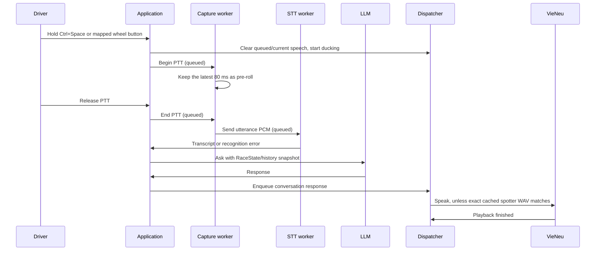

# Voice Input and Speech Output

This page describes the current keyboard/DirectInput, microphone, STT, radio,
TTS, and audio ducking paths. For telemetry, event, and LLM architecture, see
the [main architecture guide](../architect.md).

## Runtime flow

```mermaid
flowchart LR
    KEY["Ctrl+Space"] --> APP["Application"]
    WHEEL["DirectInput button"] --> APP
    APP -->|queued start / stop| CAP["AudioCapture<br/>AudioCaptureWorker"]
    CAP -->|mono PCM, 16 kHz, s16| INPUT["VoiceInputController<br/>80 ms pre-roll"]
    INPUT -->|release PTT| STT["WhisperRecognizer<br/>SpeechRecognitionWorker"]
    STT -->|transcript| LLM["LLMManager<br/>OpenAI-compatible HTTP"]
    LLM -->|reply| DISPATCH["MessageDispatcher"]
    EVENTS["Race events, spotter,<br/>strategy, lap summary"] --> DISPATCH
    DISPATCH -->|exact cached phrase| CACHE["Spotter WAV"]
    DISPATCH -->|dynamic text| NORM["RacingTextNormalizer"]
    NORM --> G2P["Native VieNeu G2P + TTS"]
    G2P --> PCM["In-memory mono PCM"]
    CACHE --> OUT["QAudioSink"]
    PCM --> OUT
    PTT["PTT held"] --> DUCK["AudioDucker"]
    OUT -->|speaking| DUCK
    DUCK -->|Windows Core Audio| GAME["Simulator audio sessions"]
```

## Push-to-talk and capture

- The application event filter maps **Ctrl+Space** key down/up to PTT while
  keyboard PTT is enabled. Key auto-repeat is ignored. DirectInput scans the
  configured controller GUID/button on an 8 ms poll. A two-second timer
  rescans when no device is present or the mapped controller is missing;
  mapping stores the first newly pressed button.
- PTT is accepted only after both voice backends report successful startup
  warm-up. On press, `Application` marks PTT active, updates ducking, clears the
  radio queue/current playback, optionally plays `sound.mp3`, and queues PTT
  start. On release, it queues the end of that utterance; the microphone device
  keeps capturing between holds.
- `AudioCapture` continuously reads the selected Windows input (system default
  if unset). It requests mono 16 kHz signed 16-bit PCM when supported; otherwise
  it converts the device's preferred format by averaging channels and
  resampling. The controller retains only the latest 80 ms outside PTT, then
  appends PCM while PTT is held. An utterance at or below the pre-roll length is
  ignored. Captured speech stays in memory; this path does not write microphone
  audio to disk.
- There is no maximum PTT recording duration in the current controller. A long
  hold grows the in-memory utterance until release.

Implementation: [Application](../../src/app/Application.cpp),
[DirectInput monitor](../../src/input/DInputButtonMonitor.cpp),
[capture/resampling](../../src/audio/AudioCapture.cpp), and
[utterance controller](../../src/audio/VoiceInputController.cpp).

## PhoWhisper STT and local compute

`WhisperRecognizer` resolves
`models/ggml-phowhisper-small-q5_1.bin` beside the executable, with a
development-tree fallback. It creates one reusable whisper.cpp context on the
`SpeechRecognitionWorker` thread, loads and warms it at startup, and keeps the
context resident until shutdown. Inference uses greedy decoding, no prior
utterance context, one segment without timestamps, a 768 audio-context window,
and a racing prompt that preserves common English racing terms. Audio is
mean-centered and quiet input is amplified before inference.

The recognizer currently forces the Whisper language to Vietnamese. Its
`language` argument is ignored, including the `vi` passed by `Application`;
English racing vocabulary is included in the prompt, but the code does not
select English decoding for an English utterance. The returned language label
is used to choose the LLM response language.

`LocalAiRuntime` resolves the persisted `auto`, `cpu`, or `vulkan:<index>`
selection once during application construction. `auto` chooses the first
available ggml Vulkan device, or CPU if none is available. The selected device
is shared with both local voice backends. CMake enables whisper.cpp Vulkan when
`VULKAN_SDK` is present; PhoWhisper retries on CPU after Vulkan initialization,
warm-up, or inference failure. VieNeu reports its backbone/codec backends and
also retries CPU if Vulkan initialization fails. In this checkout the native
VieNeu runtime is staged under `third_party/vieneu-bin`; its semantic backbone
can use Vulkan while the acoustic/codec path remains CPU work. Changing the
compute device takes effect after restart.

STT uses eight CPU threads by default. `RACEENGINEER_STT_THREADS` accepts 4, 6,
or 8; `RACEENGINEER_STT_MAX_TOKENS` accepts 16 to 64 (default 48); and
`RACEENGINEER_STT_FLASH_ATTN=0` disables Flash Attention. These are process
environment overrides, not UI settings.

The current lifecycle has a hard startup gate: `startupReady` becomes true only
after **both** PhoWhisper and VieNeu warm successfully. A missing model or
failed warm-up sets the startup error and leaves PTT and text questions gated,
although telemetry continues on its worker. At runtime, missing/failed
recognition reports an error; an unavailable configured microphone falls back
to the system default, while no usable microphone reports a capture error.

Implementation: [recognizer](../../src/stt/WhisperRecognizer.cpp),
[runtime selection](../../src/ai/LocalAiRuntime.cpp),
[settings](../../src/config/SettingsManager.h), and
[build configuration](../../CMakeLists.txt).

## VieNeu TTS

`VieNeuTtsBackend` owns a worker thread and a persistent native VieNeu context.
It initializes the native v3 Turbo profile from `models/vieneu-v3/` and uses
the configured preset ID from `voices_v3_turbo.json` (`Minh Đức` by default).
Available preset names are read from that JSON, so added presets appear in the
voice list. The backend maps known presets to their native speaking styles and
uses preset speaker codes rather than an external reference recording.

Before synthesis, `RacingTextNormalizer` expands Vietnamese numbers, lap times,
gaps, telemetry units, positions, abbreviations, and racing terms into text
that is easier to pronounce. VieNeu then phonemizes with its native Vietnamese
G2P path and synthesizes through the native C++ integration. The native
backbone may run on Vulkan; acoustic synthesis and audio decoding run on CPU.
Float audio is clamped, converted to mono signed 16-bit PCM, and held in memory
for `QAudioSink` playback. The runtime applies the configured output device,
volume, and a fixed gain boost before the sink volume. It passes four threads
to native initialization and sets `OMP_NUM_THREADS=6` for the acoustic CPU path
only when the process has not already set that variable.

Exact normalized spotter phrases can bypass synthesis. The backend loads
`audio/spotter/manifest.json` beside the executable or falls back to
`assets/spotter/manifest.json`, then picks a WAV variant for a matching phrase.
It avoids repeating the last variant when multiple variants exist. A missing
or unreadable cache entry falls through to normal VieNeu synthesis.

Synthesis uses incrementing request IDs. `stop()` invalidates the active ID and
stops playback; it does not interrupt a native synthesis call already running
on the worker. Any result returned for an invalidated ID is discarded. Model
initialization and a warm-up phrase synthesis happen before the backend is
reported ready. The phrase is discarded and not played to the driver.

Implementation: [VieNeu backend](../../src/tts/VieNeuTtsBackend.cpp),
[text normalizer](../../src/tts/RacingTextNormalizer.cpp),
[native phonemizer](../../third_party/vieneu.cpp/src/vieneu/vieneu.cpp),
[v3 native engine](../../third_party/vieneu.cpp/src/vieneu/v3_native/vieneu_v3_native.cpp),
and [native API](../../third_party/vieneu.cpp/src/vieneu/vieneu_tts.cpp).

### Native stages and assets

Dynamic speech follows normalized text, native Vietnamese G2P, phoneme
tokenization/prompt embeddings, semantic backbone decoding, acoustic code
generation and codec decoding. The backend then converts float samples to
signed PCM using the native result's sample rate. Speaker/style codes come
from the selected preset; runtime synthesis does not train or clone a voice.

| Asset | Runtime responsibility |
| --- | --- |
| `sea_g2p.bin` beside the executable | Native Vietnamese phonemizer data. |
| `models/vieneu-v3/config.json`, `tokenizer.json` | v3 configuration and phoneme/token mapping. |
| `models/vieneu-v3/backbone.gguf` | Resident semantic backbone, with CPU/Vulkan selection. |
| `models/vieneu-v3/vieneu_v3_heads.npz` | Native v3 projection/output weights. |
| `models/vieneu-v3/acoustic/vieneu_acoustic_weights.npz` | Acoustic code generation on CPU. |
| `models/vieneu-v3/codec/moss_audio_tokenizer_decode_full.onnx` | MOSS codec decoder through the staged ONNX Runtime CPU path. |
| `models/vieneu-v3/voices_v3_turbo.json` | Available preset names and speaker/reference codes. |
| `audio/spotter/manifest.json` and WAV variants | Exact-phrase cache bypassing dynamic inference. |

The [voice training guide](../training.md) covers producing/replacing backbone,
heads and presets. Acoustic/codec assets remain required when a custom voice
export is installed. The [build guide](../build.md) covers staging native DLLs
and packaging assets.

## Radio queue, priorities, and staleness

`MessageDispatcher` serializes conversation, deterministic engineer alerts,
spotter, strategy, and lap-summary speech. Priorities are ascending:
`Conversation < Engineer < Important < Spotter < Critical`. Equal-priority
messages keep insertion order. An incoming message preempts active playback only
when its priority is strictly higher; a still-valid interrupted message is
queued behind it for replay from the beginning. A newer pending lap summary
replaces an older one. Spotter messages are retained only while
their left/right state remains current, and disabling a feature or changing
session cancels its source's queued or active audio. Identical text is
suppressed when it was last spoken within 3.5 seconds.

There is no global queue capacity or wall-clock TTL. Staleness is handled by
source-specific cancellation, live proximity-state checks, replacement of lap
summaries, and pruning lower-priority general messages during preemption
(spotter and summary messages are retained). Other queued events can wait until
played, cleared, or pruned. A PTT press clears
current and queued speech, but does not cancel an in-flight STT or LLM request.

Lap summaries are held as one latest pending summary while PTT or a direct
conversation reply is busy. They are queued once voice status returns to idle;
session changes or disabling summaries cancels them. A summary interrupted by
urgent audio is replayed unless a newer summary is waiting.

The dispatcher sequence orders queued messages; a local active-playback sentinel
suppresses finish notifications after a stop. The finish signal itself has no
request ID. The TTS backend has separate synthesis request IDs; STT has no
utterance generation ID. STT cancellation is an atomic whisper abort flag,
currently used by application shutdown. A new LLM `ask` cancels the
previous provider request; resetting conversation cancels that request and
clears LLM history, but does not unload local voice models or clear the radio
queue.

Implementation: [dispatcher](../../src/audio/MessageDispatcher.cpp),
[application message routing](../../src/app/Application.cpp),
[LLM request/reset behavior](../../src/llm/LLMManager.cpp), and
[Whisper cancellation](../../src/stt/WhisperRecognizer.cpp).

## Threads and settings

| Work | Thread / owner |
| --- | --- |
| QML facade, settings, dispatcher, audio playback and UI notifications | Application/UI thread |
| Microphone device reads and PCM conversion | `AudioCaptureWorker` (`audioThread_`, low priority) |
| Whisper model load and inference | `SpeechRecognitionWorker` (`sttThread_`, normal priority) |
| DirectInput polling | `inputThread_` (low priority) |
| VieNeu initialization and synthesis | Backend-owned worker thread |
| Telemetry polling | Separate low-priority telemetry thread |
| LLM HTTP/SSE | Qt asynchronous network API; no model inference thread in this process |

Queued Qt signals cross the capture, STT, DirectInput, and TTS worker
boundaries. The local voice models are resident after startup; choosing another
compute device requires restart. Settings are persisted in the application
settings JSON: input device ID/name; keyboard PTT (default on); DirectInput PTT
(default off), device GUID/name/button; TTS preset, output device, volume
(default 0.85); audio ducking (default on, factor 0.25); and local AI compute
mode/device (default auto).

`AudioDucker` uses Windows Core Audio session volumes. When AC/ACC has an active
audio session, it reduces the simulator session; if no known simulator session
is found, it applies the factor to eligible sessions. It saves original
per-process volumes and restores them after both PTT and TTS playback end.

## Existing offline checks

[`RaceStateTests.cpp`](../../tests/RaceStateTests.cpp) covers text normalization,
ducking state/settings, and dispatcher ordering, preemption, and lap-summary
cancellation with a fake TTS backend. Run it with
`ctest --test-dir build --output-on-failure`. It does not exercise a real
microphone, DirectInput wheel, PhoWhisper model, or VieNeu runtime; those require
the corresponding Windows devices and local model assets.
